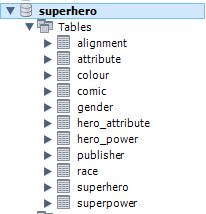
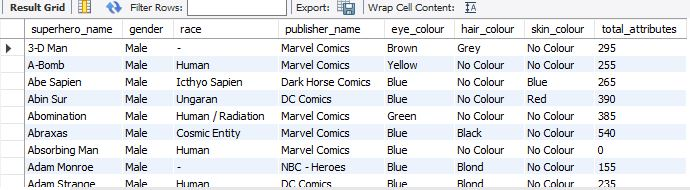
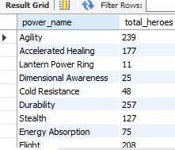
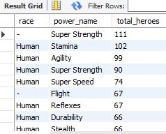

# Superhero Database SQL Solutions

## Overview
This presentation showcases SQL queries crafted to tackle specific assessment questions concerning a superhero database. The focus is on extracting and analyzing data related to superheroes, their attributes, and their superpowers. Each section includes the SQL query, an explanation of its functionality, and key points for understanding the query's purpose and execution.

**Tool:** MySQL Workbench

#### Superhero Database

## 1. Querying Superhero Attributes
### Problem Statement:
Write a query that shows all the superheroes and the sum of their attributes, including those with no attributes. This query should return the sex, race, publisher, eye color, hair color, and skin color of each superhero.

<pre>
SELECT 
    s.superhero_name, 
    g.gender, 
    r.race, 
    p.publisher_name, 
    c1.colour AS eye_colour, 
    c2.colour AS hair_colour, 
    c3.colour AS skin_colour,
    COALESCE(SUM(ha.attribute_value), 0) AS total_attributes
FROM superhero s
LEFT JOIN gender g ON s.gender_id = g.id
LEFT JOIN race r ON s.race_id = r.id
LEFT JOIN publisher p ON s.publisher_id = p.id
LEFT JOIN colour c1 ON s.eye_colour_id = c1.id
LEFT JOIN colour c2 ON s.hair_colour_id = c2.id
LEFT JOIN colour c3 ON s.skin_colour_id = c3.id
LEFT JOIN hero_attribute ha ON s.id = ha.hero_id
GROUP BY 
    s.superhero_name, 
    g.gender, 
    r.race, 
    p.publisher_name, 
    c1.colour, 
    c2.colour, 
    c3.colour;
  </pre>

### Explanation:
1. Select Columns: Retrieves the superhero's name, gender, race, publisher name, eye color, hair color, and skin color.
2. LEFT JOINs: Ensures all superheroes are included, even those with no attributes.
3. SUM() and COALESCE(): Calculates the sum of the attribute values for each superhero, returning 0 if there are no attributes.
4. GROUP BY: Aggregates the results by the selected columns.

### Key Points:
- Ensures inclusion of all superheroes.
- Aggregates attribute values.
- Handles superheroes with no attributes by returning 0.

## 2. Counting Superheroes with Each Superpower
### Problem Statement:
Write a query that returns the list of all superpowers and the sum of superheroes that have this superpower.

<pre>
SELECT 
    sp.power_name,
    COUNT(hp.hero_id) AS total_heroes
FROM superpower sp
LEFT JOIN hero_power hp ON sp.id = hp.power_id
GROUP BY sp.power_name;
  </pre>

### Explanation:
1. Select Columns: Retrieves the power name and the count of hero IDs.
2. JOIN: Connects superpowers to superheroes.
3. GROUP BY: Aggregates the count of heroes for each superpower.
4. LEFT JOIN: Includes all superpowers, even those without heroes.

### Key Points:
- Connects superpowers to superheroes.
- Aggregates hero count per superpower.
- Ensures all superpowers are included.

## 3. Finding the Most Prevalent Superpower by Race
### Problem Statement:
Write a query to return the list of races and which superpower is the most prevalent in each race of superhero.

<pre>
SELECT 
    r.race,
    sp.power_name,
    COUNT(hp.hero_id) AS total_heroes
FROM race r
JOIN superhero s ON r.id = s.race_id
JOIN hero_power hp ON s.id = hp.hero_id
JOIN superpower sp ON hp.power_id = sp.id
GROUP BY r.race, sp.power_name
ORDER BY total_heroes DESC;
  </pre>

### Explanation:
1. Select Columns: Retrieves race, power name, and count of heroes with that power.
2. JOINS: Connects race information to superpowers.
3. GROUP BY: Counts the number of heroes with each superpower for each race.
4. ORDER BY: Orders by the count of heroes descending to highlight the most prevalent superpower.

### Key Points:
- Connects race to superpowers.
- Aggregates hero count by race and superpower.
- Highlights the most prevalent superpower for each race.

## Conclusion
These queries demonstrate how to extract and analyze data from a superhero database, focusing on attributes, superpowers, and their prevalence across different races. The explanations and key points provide a clear understanding of the purpose and execution of each query.
